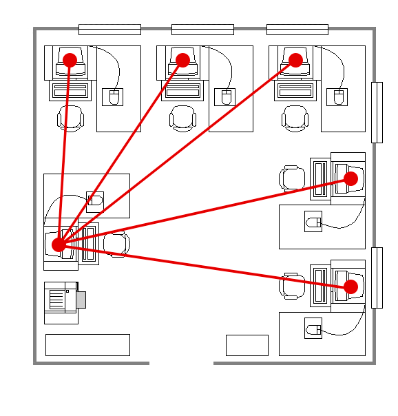

# Laus

*LAN Users Specs*. Программное обеспечение для передачи характеристик устройств между устройствми в локальной сети, написанное на C# (.NET Framework 4.8).

       

## Возможности

Программное обеспечение реализует следующие возможности:

* Получение характеристик собственного устройств;
* Получение характеристик устройств из локальных сетей (с установленным клиентом).

Дополнительные возможности:

* Поиск устройств в локальных сетях (с установленным клиентом);
* Выполненеие запроса к устройству с вручную указанным адресом;
* Обозначение собственного устройства уникальным именем для последующей идентификации.

## Принцип работы

Программное обеспечение организует децентрализованную сеть (P2P) для передачи данных между всеми клиентами. Соответственно, запрос на получение информации может быть выполнен от любого участника сети к аналогичному по правам участнику.

**Пример:** Организация пользовательских компьютеров в локальной сети с последующим анализом характеристик на устройстве администратора.

       

## Определяемые характеристики

Получение характеристик устройств выполняется с помощью динамически подключаемой библиотеки [WinHardwareSpecs](https://github.com/Ggorets0dev/win-hardware-specs-dll). Возможности могут быть обнаружены в документации или исходном коде программного обеспечения. 

## Сторонние библиотеки

Программное обеспечение использует следующие сторонние библиотеки, которые добавляются при сборке:

* [WinHardwareSpecs](https://github.com/Ggorets0dev/win-hardware-specs-dll)